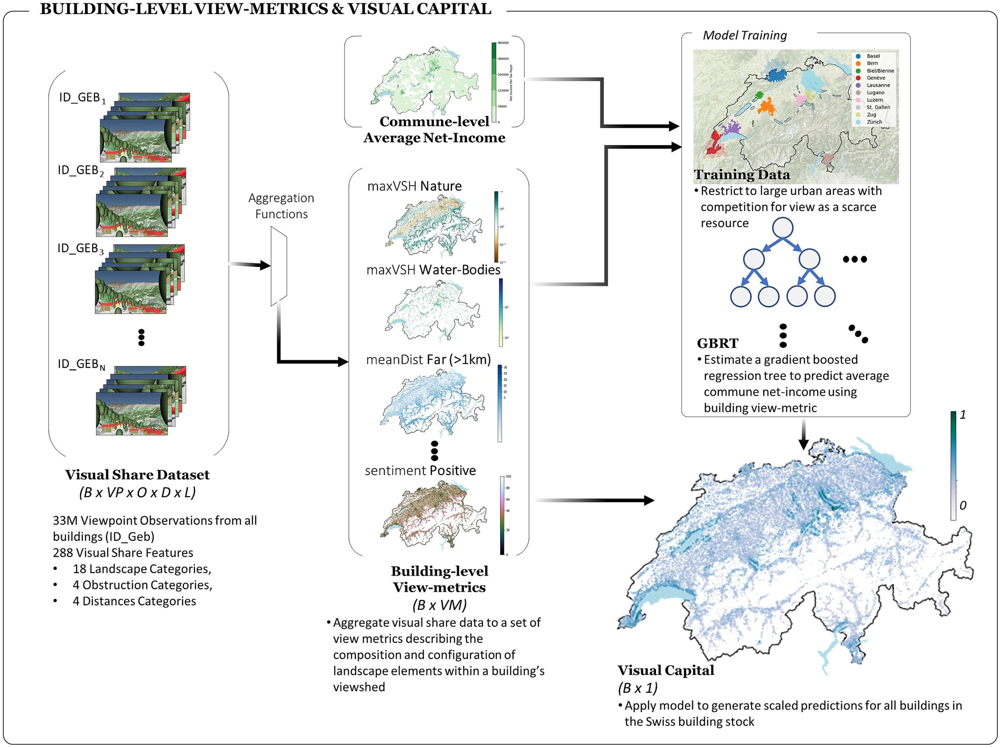

---

<!-- ##### Download

+ [Paper](paper1.pdf)
+ [Online appendix](appendix1.pdf)
+ [Code and data](https://github.com/pmichaillat/job-rationing) -->

---

##### Abstract

Evaluating visual landscape quality provides valuable information for urban development and spatial planning. In practice however, obtaining high resolution view-metrics and outcome data with sufficient geographic coverage has remained challenging. To overcome this limitation, we construct a scalable measure of visual landscape quality by first defining building-level view-metrics derived from a large-scale 3D representation of Switzerland’s building stock. Leveraging the principle of income-sorting, we estimate visual preferences by calibrating the building level view-metrics with commune-level incomes (CLI). The learned model captures common intuition on visual preferences, i.e. attributing positive weight to lake-views, and identifies context-dependent relationships between view metrics. To contextualize the derived quantitative measure, we refer to the preference for a building’s portfolio of viewpoints as a building’s visual capital (VC). By assessing the supply of VC across Switzerland’s entire building stock, we uncover an association between VC and the urban and natural form, where urban density and landscape topology explain the strength of view-driven-income sorting across agglomerations. We demonstrate that spatial clustering of VC varies across cities and frequently crosses administrative boundaries. Finally, we release a privacy protected version of VC at www.visualcapital.xyz, which we expect to promote future interdisciplinary studies focused on correlates of visual landscape quality (whether financial, social, environmental or physiological).

---

##### Figure X: Figure caption



---

##### Citation

Swietek, A. R. & Zumwald, M. Visual Capital: Evaluating building-level visual landscape quality at scale. Landscape and Urban Planning 240, 104880 (2023) https://doi.org/10.1016/j.landurbplan.2023.104880 

```BibTeX
@article{SWIETEK2023104880,
	author = {Adam R. Swietek and Marius Zumwald},
	doi = {https://doi.org/10.1016/j.landurbplan.2023.104880},
	journal = {Landscape and Urban Planning},
	pages = {104880},
	title = {Visual Capital: Evaluating building-level visual landscape quality at scale},
	volume = {240},
	year = {2023},

```

---

##### Related material

+ [Visualize Data](http://www.visualcapital.xyz)
+ [EPFL Open Data](https://www.epfl.ch/schools/enac/open-visual-capital-data/)

