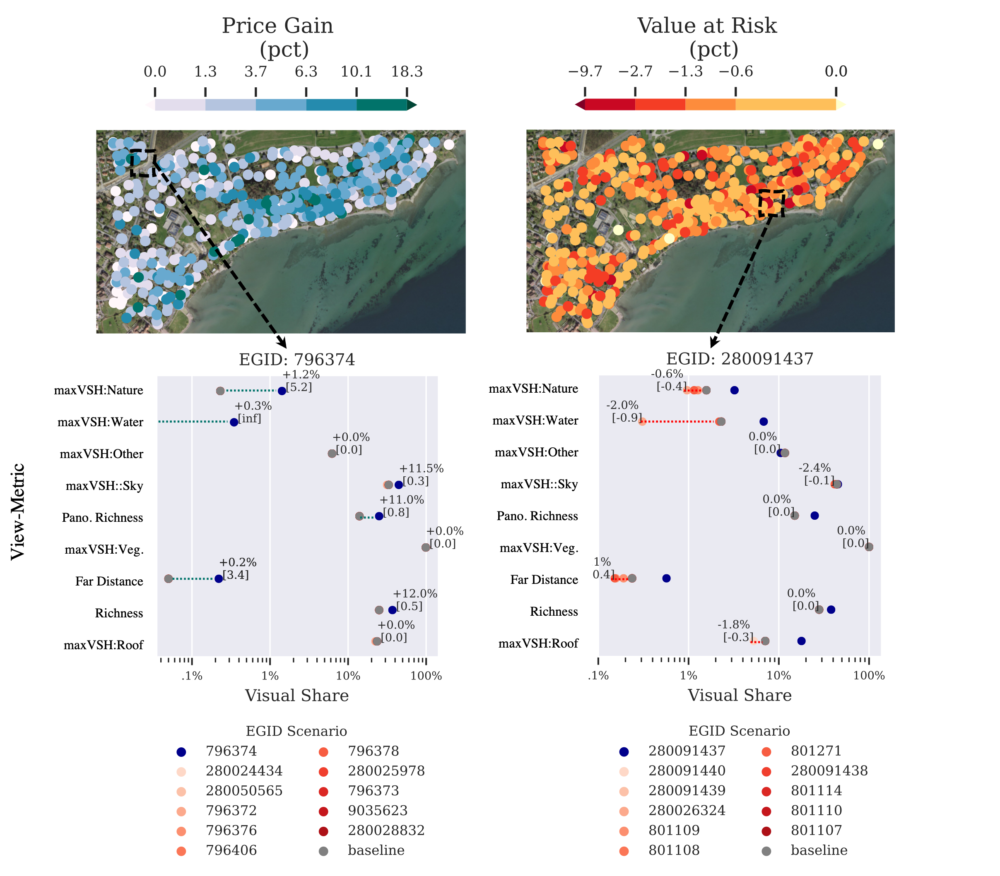

---

##### Download

+ [WP](https://www.dropbox.com/preview/PhD/working_papers_shared/ADA_manuscript.pdf)
+ [Paper, pre-print](http://dx.doi.org/10.2139/ssrn.4670069)
<!-- + [Online appendix](appendix2.pdf) -->
<!-- + [Code and data](https://github.com/pmichaillat/unemployment-gap) -->

---

##### Abstract

Financial criteria in architectural design evaluation are limited to cost performance. Here, I introduce a method – Automated Design Appraisal (ADA) – to predict the market price of a generated building design concept within a local urban context. Integrating ADA with 3D building performance simulations enables financial impact assessment that exceeds the spatial resolution of previous work. Within an integrated impact assessment, ADA measures the direct and localized effect of urban development. To demonstrate its practical utility, I study local devaluation risk due to nearby development associated with changes to visual landscape quality. The results shed light on the relationship between amenities and property value, identifying clusters of properties physically exposed or financially sensitive to local land-use change. Beyond its application as a financial sensitivity tool, ADA serves as a blueprint for architectural design optimization procedures, in which economic performance is evaluated based on learned preferences derived from financial market data. 


---

##### Figure 6: Figure caption



<!-- ---

<!-- ##### Citation -->

Swietek, Adam, Automated Design Appraisal: Estimating Real Estate Price Growth and Value at Risk Due to Local Development. Available at SSRN: https://ssrn.com/abstract=4670069 or http://dx.doi.org/10.2139/ssrn.4670069

```BibTeX
@article{AAYY,
author = {Adam R Swietek},
doi = {10.2139/ssrn.4670069},
journal = {SSRN},
title ={Automated Design Appraisal: Estimating Real Estate Price Growth and Value at Risk Due to Local Development.},
year = {2023}}
``` 

<!-- ---
number = {Issue},
pages = {XXX--YYY},
volume = {Volume},
##### Related material

+ [Lecture Presentation](https://youtu.be/o8qmGErEjCQ?si=abJYgBgNjCpOQZuO&t=69) -->

